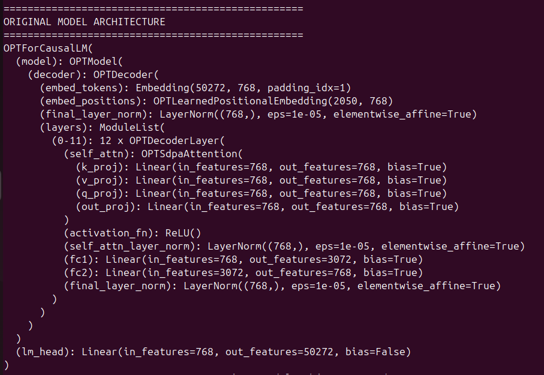
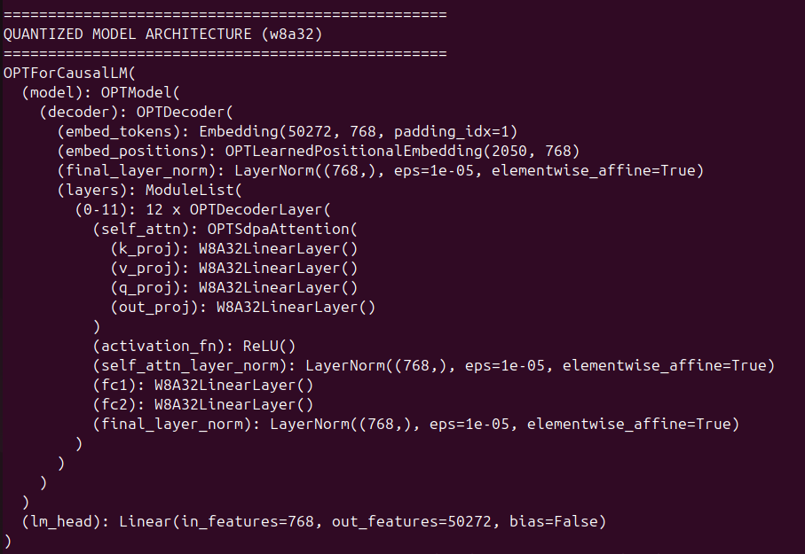

# TinyQ

A lightweight PyTorch model quantization library focused on simplicity and ease of use.

## Features

- `8-bit` weight quantization (W8A32, W8A16)
- `32-bit` and `16-bit` activations for linear layers.
- Support for PyTorch models with nn.Linear layers
- Offline-first approach - no automatic downloads
- Built-in benchmarking tools (Still to come)
- Simple API (Still to come)


## Project Structure

```
TinyQ/
├── logs/              # Benchmark and training logs
├── models/            # Local model storage
├── tinyq.py           # Core quantization library
├── utils.py           # Utility functions
├── examples.py        # Usage examples
└── bench.py           # Benchmarking tools (Coming soon)
```

## Installation

```bash
# Clone repository
git clone https://github.com/afondiel/TinyQ.git
cd TinyQ

# Create and activate conda environment
conda create -n tinyq python=3.8
conda activate tinyq

# Install requirements
pip install -r requirements.txt
```

## Quick Start

### 1. Download Your Target Model

> [!IMPORTANT]
> TinyQ operates in `offline` mode (i.e., locally). Download your models before using the library:

```bash
# Example for CodeGen model
huggingface-cli download --resume-download Salesforce/codegen-350M-mono --local-dir ./models/Salesforce/codegen-350M-mono
```

See the full [Model Setup Guide](docs/model_setup.md) for detailed instructions.

### 2. Run Quantization

```python
from tinyq import Quantizer
from utils.model_utils import load_model, get_generation

# Load model from local path
model, tokenizer = load_model("./models/Salesforce/codegen-350M-mono")

# Initialize quantizer
quantizer = Quantizer(model)

# Quantize model (W8A32 or W8A16)
quantized_model = quantizer.quantize(q_method="w8a32")

# Test inference
prompt = "def fibonacci(n):"
result = get_generation(quantized_model, tokenizer, prompt)
print(result)

# Save quantized model
quantizer.save_model("./quantized_model")
```

Using Commnand line:
```bash
python examples.py --model_path "./models/Salesforce/codegen-350M-mono" --qm w8a32 --qmodel_path "./quantized_model"
```
## Roadmap

### Current Focus
- [x] W8A32 implementation
- [x] W8A16 implementation
- [ ] Documentation and examples
- [ ] Unit tests

### Core Features
- [ ] W8A8 Quantization Support
- [ ] Model Support Extensions
- [ ] Additional Layer Support
- [ ] Performance Optimization

## Demo

The example below shows a Pytorch model trace before and after a W8A32 Quantization.

Before: 



After:



You can also use a tool like [NEUTRON](https://netron.app/) get more in-depth insight and compare both models.

## Benchmark

(Still to Come)

## Contributing

Contributions are welcome! If you want to help this project grow, you can pick one of the listed topics in the [Roadmap](#roadmap). Please see the [Contributing Guidelines](CONTRIBUTING.md).

## License

This project is licensed under the MIT License - see the [LICENSE](LICENSE) file for details.